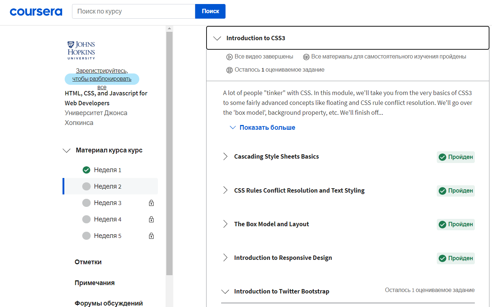

# Kottans-frontend

# Stage 0

-   [x] **Git Basics**
-   [x] **Linux CLI and Networking**
-   [x] **GitHub and Collaboration**
-   [x] **Intro to HTML & CSS**
-   [x] **Responsive Web Design**
-   [ ] **HTML & CSS Practice**
-   [ ] **JavaScript Basics**
-   [ ] **Document Object Model - practice**
-   [ ] **Building a Tiny JS World - practice**
-   [ ] **Object oriented JS - practice**
-   [ ] **OOP exercise - practice**
-   [ ] **Offline Web Applications - optional**
-   [ ] **Memory pair game — real project!**
-   [ ] **Website Performance Optimization - optional**
-   [ ] **Friends App - real project!**

## General

 
 Git & Version Control

> I learned a lot of new git commands :

`git rebase`
`git cherry-pick`
`git revert`
`git reset`

> Others I knew and used before.

 Linux CLI, and HTTP

> I learned a lot of new commands to Linux, and also interesting information about HTTP

Git Collaboration

> Lots of new information about git control

## Front-End Basics

Intro to HTML and CSS

> Interesting course at codecademy, many useful exercises. I refreshed my memory.

Responsive Web Design

> I learned new information about grid layout,
> it was difficult to understand the new layout technology.
> I hope that knowledge about grids will help me in the future.

